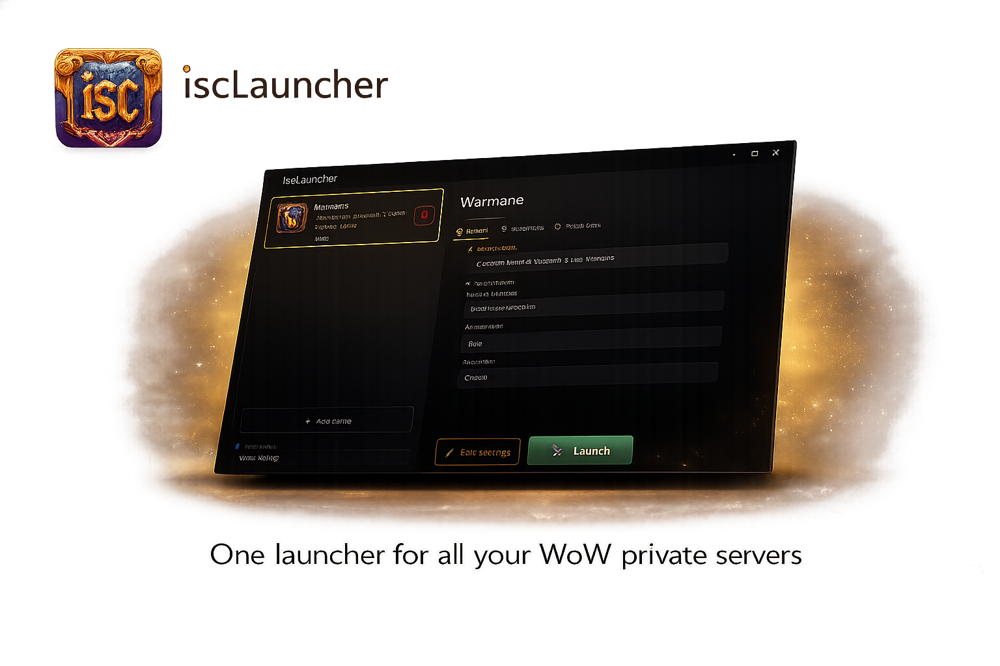
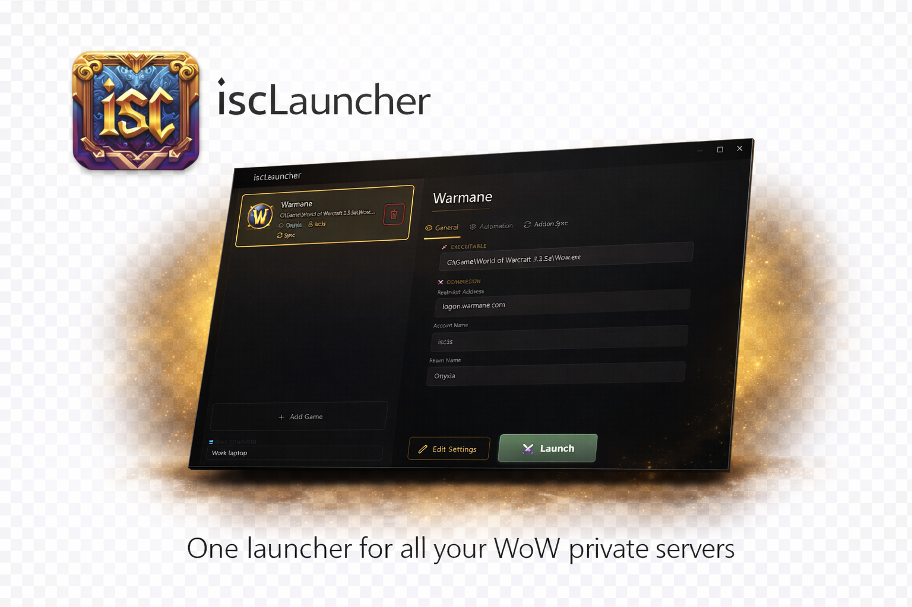

<h1 align="center">
  iscLauncher
</h1>

<p align="center">
  One launcher for all your WoW private servers
</p>

<p align="center">
  <a href="https://github.com/iiisc/iscLauncher/releases/latest"></a>&nbsp;
  &nbsp;
  <a href="https://github.com/iiisc/iscLauncher/releases/latest"></a>
</p>

---

<p align="center">
  
</p>

<p align="center">
  
</p>

---

Tired of juggling

Add your games, hit **Launch**, and you're in.

---

## ✨ What It Does

### 🎮 All Your Servers in One Place
Keep every WoW installation — Warmane, ChromieCraft, Turtle WoW, whatever you play — organized in a single list. Each game shows its own icon, server name, and account so you always know which is which.

### ⚔ One-Click Launch
No more hunting for realmlist files. iscLauncher automatically sets the correct server address, account name, and realm before it opens the game. Just click **Launch**.

### 🔐 Auto-Login
Store your password once and iscLauncher types it in for you when the login screen appears. Your passwords are kept safe using Windows' built-in credential vault — they're never saved in a text file or anywhere you can accidentally leak them.

### 🔄 Sync Addons Across PCs
Play on a desktop and a laptop? Link a private GitHub repo and iscLauncher will keep your **addons** and **per-character settings** (keybinds, macros, UI layout) in sync between machines.

- **Pull** your setup onto a new PC in one click
- **Push** changes from whichever machine you're on
- **Rollback** to a previous version if something breaks

---

## 📥 Getting Started

### Download

1. Head to the [**Latest Release**](https://github.com/iiisc/iscLauncher/releases/latest)
2. Download the `.zip` file
3. Extract it anywhere and run **iscLauncher.exe**

That's it — no installer, no extra software needed.

### Add Your First Game

1. Click **+ Add Game** and browse to your WoW `.exe`
2. Fill in the server address (realmlist), your account name, and realm
3. Enter your password — it's stored securely on your machine
4. Double-click the game card or press ⚔ **Launch**

### Sync Addons (Optional)

If you play on more than one PC:

1. Create a **private** repository on GitHub (e.g. `my-wow-sync`)
2. Open the game's settings, go to the **Addon Sync** tab, and paste the repo URL
3. Use **Push** on your main PC to upload your addons & settings
4. Use **Pull** on your other PC to download them

---

## 🔒 Is It Safe?

- Passwords are stored in **Windows Credential Manager**, the same place Windows keeps your Wi-Fi passwords. They never touch a file on disk.
- If you use the clipboard option, the password is automatically cleared after 30 seconds.
- Deleting a game entry also removes its stored password.

---

## 💡 Tips

- **Startup delay** — If the launcher types your password before the login screen is ready, increase the delay in the game's Automation settings.
- **Input method** — *SendKeys* works best for most WoW clients. Switch to *Clipboard* if you run into issues with special characters.
- **Computer name** — The name shown at the bottom-left is used during addon sync so each PC can keep its own keybindings. Give each machine a unique name.

---

## 🛠 Building from Source

<details>
<summary>For developers</summary>

### Prerequisites
- [.NET 8 SDK](https://dotnet.microsoft.com/download/dotnet/8.0) (Windows 10.0.19041+)
- Visual Studio 2022 with the **Windows App SDK** workload, or the .NET CLI

### Build & Run
```bash
git clone https://github.com/iiisc/iscLauncher.git
cd iscLauncher
dotnet build iscLauncher.csproj -c Debug
dotnet run --project iscLauncher.csproj
```

### Publish a Portable Executable
```bash
dotnet publish iscLauncher.csproj -c Release -r win-x64 ^
  -p:PublishSingleFile=true ^
  -p:SelfContained=true ^
  -p:WindowsAppSDKSelfContained=true ^
  -p:WindowsPackageType=None ^
  -p:IncludeNativeLibrariesForSelfExtract=true ^
  -p:EnableCompressionInSingleFile=true ^
  -o publish
```

</details>

---

## 🤝 Contributing

Have an idea or found a bug? [Open an issue](https://github.com/iiisc/iscLauncher/issues) or send a pull request — all contributions are welcome!

---

## 📄 License

This project is provided as-is. See the repository for license details.

---

<p align="center">
  <sub>Built with ❤️ for the private server community</sub>
</p>
