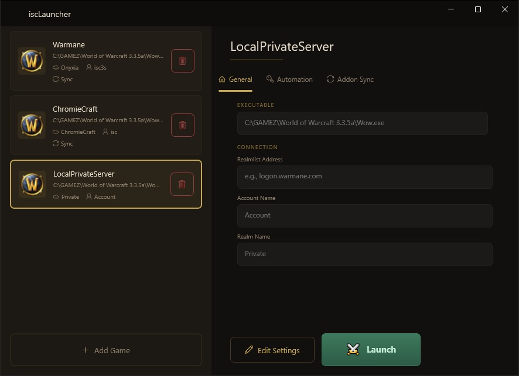

# iscLauncher

> Unified launcher for World of Warcraft private servers.

Manage multiple WoW private server installations from one place. iscLauncher handles realmlist configuration, account pre-fill, and credential-secured auto-login — no manual file editing required.

---

## Features

- **Multi-server library** — each entry stores its own executable, server address, account, and realm
- **Auto realmlist & config update** — `realmlist.wtf` and `WTF\Config.wtf` are written before every launch
- **Auto-login** — passwords are kept in Windows Credential Manager and delivered via `SendInput` or clipboard
- **Addon sync** — push/pull `Interface\AddOns` and `WTF` to a private GitHub repo, with rollback support

---

## Requirements

- Windows 10 version 1809 (build 17763) or later · x86 / x64 / ARM64
- No runtime install needed — the release is self-contained

---

## Installation

1. Download the `.zip` from the [latest release](https://github.com/iiisc/iscLauncher/releases/latest).
2. Extract anywhere and run **iscLauncher.exe**.

> **SmartScreen:** The binary is self-signed. Click **More info → Run anyway** if prompted.

---

## Uninstallation

1. Delete the folder you extracted iscLauncher into.
2. Open **Credential Manager** (Control Panel → Credential Manager → Windows Credentials) and remove any entries prefixed with `IscLauncher`.

No registry keys or other system locations are modified by iscLauncher.

---

## Quick Start

1. Click **+ Add Game**, select the WoW `.exe`, and fill in the server address, account, and realm.
2. Enter your password — stored in Windows Credential Manager, never on disk.
3. Click **Launch**. iscLauncher updates the config files, starts the game, and types the password when the login screen appears.

---

## Addon Sync

Requires a **private** GitHub repository.

1. Paste the repo URL into the **Addon Sync** tab of a game's settings.
2. **Push** to upload addons and WTF settings. **Pull** to apply them on another machine.
3. **Rollback** to revert to the previous commit if needed.

A configurable **computer name** is included in each commit message to identify which machine made the push.

---

## Troubleshooting

| Symptom | Fix |
|---------|-----|
| Password typed too early | Increase **Startup Delay** in Automation settings |
| Special characters mistyped | Switch **Input Method** to *Clipboard* |
| No password entered at all | Increase startup delay or check the window title pattern |
| Auto-login fails on an elevated game | Run iscLauncher as administrator |
| Addon sync fails | Check the repo URL, visibility (private), and Git credentials |

---

## Contributing

Open an [issue](https://github.com/iiisc/iscLauncher/issues) or submit a pull request against the `master` branch.

---

## Code signing

Releases are self-signed. Windows SmartScreen may warn on first launch — click **More info → Run anyway** to proceed.

**Privacy policy**

This program will not transfer any information to other networked systems unless specifically requested by the user or the person installing or operating it.
Addon sync communicates exclusively with the GitHub repository URL entered by the user.
Passwords are stored locally in Windows Credential Manager and are never transmitted.

---

## License

[MIT](LICENSE)
