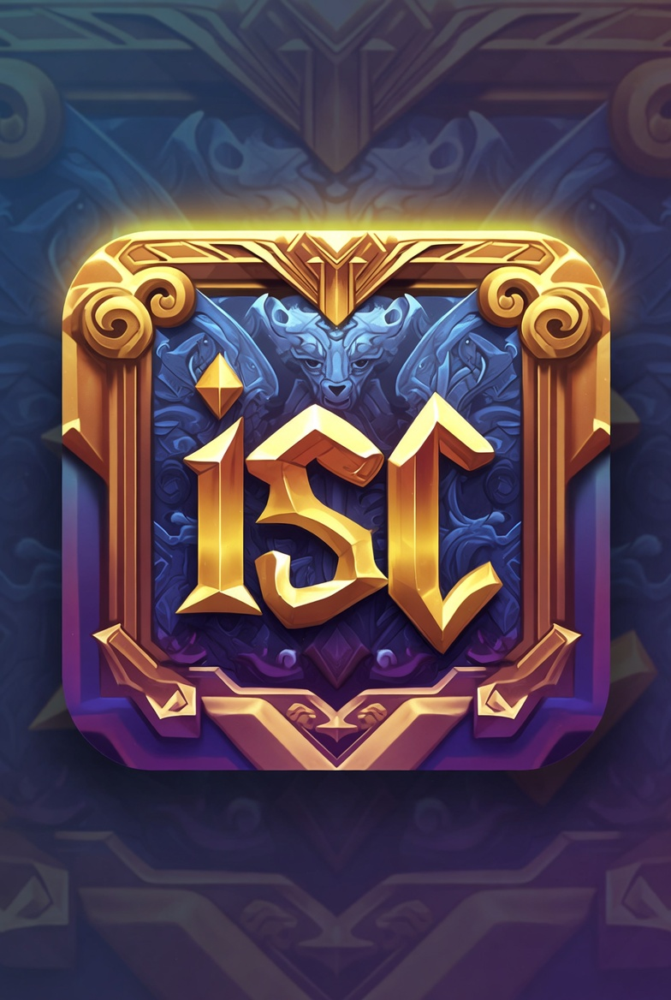
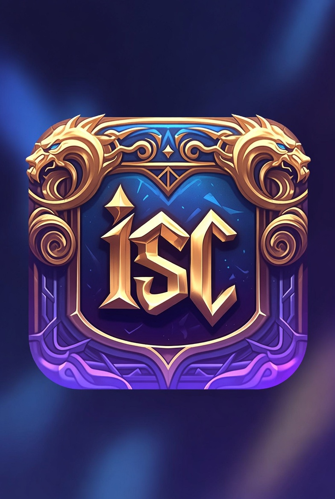

<p align="center">
  
</p>

<h1 align="center">iscLauncher</h1>

<p align="center">
  <strong>A sleek game launcher &amp; addon manager for WoW private servers</strong>
</p>

<p align="center">
  <a href="https://github.com/iiisc/iscLauncher/releases/latest"></a>
  
  
  <a href="https://github.com/iiisc/iscLauncher/releases/latest"></a>
</p>

---

<p align="center">
  
</p>

<p align="center">
  
</p>

---

## ✨ Features

### 🎮 Game Library
- Manage multiple WoW installations (retail, classic, private servers) in one place
- Auto-extracts and displays each game's icon from its executable
- Fantasy-themed dark UI with Mica backdrop — feels right at home next to your games

### ⚔ One-Click Launch
- Launches the game, updates `realmlist.wtf` and `WTF/config.txt` automatically
- Pre-fills account name, realm name, and server address before you even see the login screen
- **Automatic password entry** — types your password into the login window via `SendKeys` (best for DirectX/OpenGL) or copies it to the clipboard

### 🔐 Secure Credential Storage
- Passwords are stored in **Windows Credential Manager** — never in plain text, never on disk
- Clipboard is auto-cleared 30 seconds after copy
- Credentials are cleaned up when a game entry is deleted

### 🔄 Addon & WTF Sync
- Sync your **AddOns** and **WTF settings** across multiple PCs through a private GitHub repo
- **Pull** — download the latest addons and per-character settings from the repo
- **Push** — upload your local addons and a selected character's settings to the repo
- **Rollback** — revert to any previous commit with a visual commit history picker
- Per-character WTF merging so each machine keeps its own keybindings while sharing addon configs

### 🧠 Smart Defaults
- Auto-detects whether an executable is a DirectX game or a regular Windows app and suggests the best password input method
- Configurable startup delay for games that need extra time before the login screen is ready
- DPI-aware window sizing

---

## 📥 Installation

1. Go to the [**Latest Release**](https://github.com/iiisc/iscLauncher/releases/latest)
2. Download `iscLauncher-vX.X.X-win-x64.zip`
3. Extract anywhere and run `iscLauncher.exe`

> **No installer required.** The release is a self-contained single-file executable — no .NET runtime needed on the target machine.

---

## 🚀 Quick Start

1. **Add a game** — click the `+ Add Game` button and browse to your WoW executable
2. **Configure connection** — enter the realmlist address, account name, and realm name
3. **Set your password** — it's stored securely in Windows Credential Manager
4. **Launch** — double-click the game card or hit the ⚔ **Launch** button

### Addon Sync (optional)

1. Create a **private** GitHub repository (e.g. `my-wow-sync`)
2. In the game's **Edit Settings → Addon Sync** tab, paste the repo URL
3. Use **Push** on your main PC to upload addons & WTF settings
4. Use **Pull** on any other PC to download them

---

## 🛠 Building from Source

### Prerequisites
- [.NET 8 SDK](https://dotnet.microsoft.com/download/dotnet/8.0) (Windows 10.0.19041+)
- Visual Studio 2022 with the **Windows App SDK** / WinUI workload, or just the CLI

### Build & Run
```bash
git clone https://github.com/iiisc/iscLauncher.git
cd iscLauncher
dotnet build iscLauncher.csproj -c Debug
dotnet run --project iscLauncher.csproj
```

### Publish a Self-Contained Executable
```bash
dotnet publish iscLauncher.csproj -c Release -r win-x64 \
  -p:PublishSingleFile=true \
  -p:SelfContained=true \
  -p:WindowsAppSDKSelfContained=true \
  -p:WindowsPackageType=None \
  -p:IncludeNativeLibrariesForSelfExtract=true \
  -p:EnableCompressionInSingleFile=true \
  -o publish
```

---

## 📁 Project Structure

```
iscLauncher/
├── Assets/                  # App icons, logos, screenshots
├── Converters/              # XAML value converters
├── Dialogs/                 # Game add/edit dialog, sync dialogs, rollback picker
├── Helpers/                 # Dialog theming helpers
├── Models/                  # GameEntry, GameLibrary data models
├── Services/
│   ├── AddonSyncService     # Addon & WTF sync orchestration
│   ├── AppTypeDetector      # DirectX vs. Windows app heuristics
│   ├── CredentialService    # Windows Credential Manager wrapper
│   ├── GameLauncherService  # Launch, realmlist update, password automation
│   ├── GameRepository       # JSON-based game library persistence
│   ├── GitService           # Git CLI wrapper for clone/pull/push/log
│   ├── IconExtractor        # Extracts icons from .exe files
│   ├── PasswordAutomation   # SendKeys / clipboard password entry
│   └── RealmlistService     # realmlist.wtf & config.txt updater
├── App.xaml                 # Application resources & fantasy theme tokens
├── MainWindow.xaml          # Two-column master/detail layout
└── MainWindow.xaml.cs       # Main window code-behind
```

---

## ⚙ How It Works

| Step | What happens |
|------|-------------|
| **Add Game** | Executable path, server info, and password are saved. Password goes to Windows Credential Manager. |
| **Launch** | `realmlist.wtf` and `WTF/config.txt` are patched → process is started → password is typed or copied. |
| **Addon Sync – Pull** | Git clones/pulls the configured repo → copies `AddOns/` into `Interface/AddOns/` → merges `WTF/AccountTemplate/` into every local character folder. |
| **Addon Sync – Push** | Copies local `Interface/AddOns/` and a selected character's WTF folder into the repo cache → commits & pushes. |
| **Rollback** | Shows the repo's commit history → resets to the chosen commit → force-pushes. |

---

## 🤝 Contributing

Contributions, issues, and feature requests are welcome! Feel free to open an [issue](https://github.com/iiisc/iscLauncher/issues) or submit a pull request.

---

## 📄 License

This project is provided as-is. See the repository for license details.

---

<p align="center">
  <sub>Built with ❤️ using <strong>.NET 8</strong> and <strong>WinUI 3</strong></sub>
</p>
